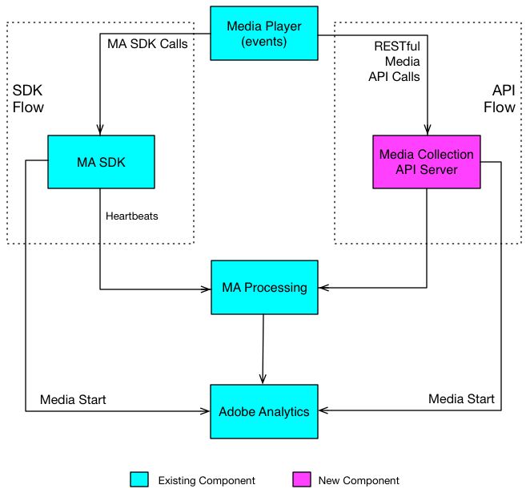

# Media Collection API

The Streaming Media Collection API is a server-side, RESTful equivalent of the client-side Media SDK for tracking streaming audio and video in Adobe Analytics. It composes a media session on Adobe's servers from a `sessions` call followed by a series of `events` calls, which are aggregated into the same media metrics that the Media SDK produces. This page introduces the Media Collection API and its two endpoints.

<InlineAlert variant="info" slots="text"/>

For new streaming media implementations, Adobe recommends the [Media Edge API](https://developer.adobe.com/data-collection-apis/docs/api/media-edge) on the Adobe Experience Platform Edge Network. This documentation covers the Analytics-specific Media Collection API, which remains fully supported for existing and server-side implementations (much as AppMeasurement remains supported alongside the newer Web SDK).

## How it relates to the Media SDK

A media player that implements the Media Collection API makes RESTful tracking calls directly to Adobe's media collection endpoint, whereas a player that implements the Media SDK makes calls to SDK methods inside the player app. Because the calls travel over the network, a Media Collection API implementation handles some of the processing (such as session management, pinging, and event ordering) that the Media SDK performs automatically. The tracking data is collected and initially processed differently for the two approaches, but the same back-end processing engine aggregates both into Analytics.

The client Media SDKs (for example, the JavaScript 3.x and Chromecast SDKs) call this same REST API under the hood, so the Media Collection API is the direct, language-independent way to send the same data from any server or platform.

## Choosing a collection method

The Media Collection API is one of several Adobe Analytics data collection methods. Use it when you need server-side, SDK-free streaming media tracking. For a comparison of all the collection methods, see the [collection method comparison](../../index.md#compare-each-method).

## Authentication

The Media Collection API does not use an authorization token. Data is routed and attributed by the Analytics parameters you send in each session: the report suite (`analytics.reportSuite`), tracking server (`analytics.trackingServer`), and IMS organization ID (`visitor.marketingCloudOrgId`). For how this compares to the other collection methods, see the [collection method comparison](../../index.md#compare-each-method).

## Media tracking data flows

A media player implementing the Media Collection API makes tracking calls to the media collection endpoint over HTTP. The endpoint is a provisioned host of the form `https://{uri}`; obtain your `{uri}` from your Adobe representative. Every call is an HTTP `POST` with a JSON request body, and every call sets the `Content-Type: application/json` request header.



## API overview

The Media Collection API has two endpoints.

* **Sessions**: Establishes a session with the server and returns a session ID used in subsequent events calls. Your app calls this once at the start of a tracking session. See [Sessions endpoint](sessions.md).

  `POST https://{uri}/api/v1/sessions`

* **Events**: Sends media tracking data to an open session. See [Events endpoint](events.md).

  `POST https://{uri}/api/v1/sessions/{sid}/events`

For the complete machine-readable specification of both endpoints, see the [Media Collection API reference](../../api/media-collection.md).

### Request body

Both endpoints accept a JSON body with the same structure:

```json
{
    "playerTime": {
        "playhead": "{playhead position in seconds}",
        "ts": "{timestamp in milliseconds}"
    },
    "eventType": "{event-type}",
    "params": {
        "{parameter-name}": "{parameter-value}"
    },
    "qoeData": {
        "{parameter-name}": "{parameter-value}"
    },
    "customMetadata": {
        "{parameter-name}": "{parameter-value}"
    }
}
```

* `playerTime`: Required on all requests. The playhead position (in seconds) and timestamp (in milliseconds since the Unix epoch).
* `eventType`: Required on all requests. The kind of media event being reported.
* `params`: Required for certain event types. The Analytics, visitor, and media parameters. See [Request parameters](parameters.md), and check the [validation schema](parameters.md#request-validation) to determine which parameters are required for each event type.
* `qoeData`: Optional on all requests. Quality-of-experience data.
* `customMetadata`: Optional. Sent only with the `sessionStart`, `adStart`, and `chapterStart` event types. See [Custom metadata](custom-metadata.md).

### Event types

The `eventType` member accepts the following values:

`sessionStart`, `sessionComplete`, `sessionEnd`, `adBreakStart`, `adBreakComplete`, `adStart`, `adComplete`, `adSkip`, `chapterStart`, `chapterComplete`, `chapterSkip`, `play`, `ping`, `bufferStart`, `pauseStart`, `bitrateChange`, `error`, `stateStart`, and `stateEnd`.

For details on when to send each event, see [Events endpoint](events.md).

## Next steps

* [Sessions endpoint](sessions.md): Start a tracking session and obtain a session ID.
* [Events endpoint](events.md): Send playback events to an open session.
* [Request parameters](parameters.md): The full parameter reference and request validation.
* [Custom metadata](custom-metadata.md): Attach custom key-value pairs to media events.
* [Implementation guide](implementation.md): An end-to-end walkthrough, from quick start through pings, timeouts, ordering, and queuing.
